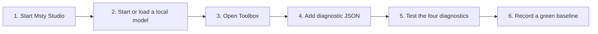

# Start here on a Mac

Msty Local Ops does not run as a separate background app. Msty Studio starts the MCP
automatically when a configured tool needs it.



## First-time setup

1. Install Msty Studio and open it once.
2. Download at least one local model in Msty. The MCP intentionally does not choose,
   download, or delete models for you.
3. Download the latest Msty Local Ops release and double-click
   `Install Msty Local Ops.command`.
4. The installer opens a folder containing two JSON files.
5. In Msty, open **Toolbox > Add New Tool > STDIO / JSON**.
6. Paste `msty-toolbox-diagnostic.json` first and use Msty's tool test.
7. Keep the separate local-inference JSON disabled unless you explicitly want an MCP
   client to see the prompts and answers sent through that tool.

## What to start each day

1. Start **Msty Studio**.
2. In Msty, start or load the local model you want to use.
3. Open your Msty project and confirm the selected model has a local provider badge.
4. If the work is private, confirm there is no online model, online embedding, web
   feature, remote tool, model group, or fallback attached to the project.
5. Attach a Knowledge Stack only after its embedding model is also confirmed local.

You do not need to start Msty Local Ops separately. Msty launches it when required.

## Check health after an upgrade

Open Terminal and run the doctor command printed by the installer. It reports:

- **GREEN** - tested Studio version and a usable local model service are ready.
- **YELLOW** - the setup works but changed, is untested, or has no advertised model.
- **RED** - Msty is missing or no valid local model service is reachable.

When the result is green and a synthetic test succeeds, run the same command with
`--record-baseline`. The next check will warn if the Studio version, adapter version,
service availability, or model count changed.

## Create a safe support file

Run:

```bash
msty-local-ops-support --output msty-local-ops-support.json
```

The file contains versions, booleans, counts, fixed local ports, and error categories.
It excludes usernames, paths, model identifiers, prompts, documents, provider details,
and credentials. It is created with private Mac file permissions. Review it before
sharing it publicly.

## Troubleshooting order

1. Make sure Msty Studio is open.
2. Make sure a local model is installed and started.
3. Run the doctor.
4. Re-test the diagnostic tool in Msty's Tool Console.
5. If a recent upgrade caused yellow drift, run the fictional Knowledge Stack canary
   in [KNOWLEDGE_STACK.md](KNOWLEDGE_STACK.md).
6. Create the redacted support file only if the problem remains.

Never place prompts, private documents, provider keys, screenshots containing private
content, or Msty data files in a public issue.
